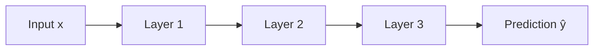
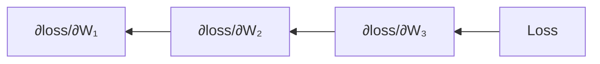
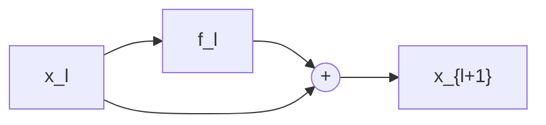
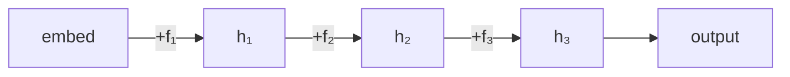
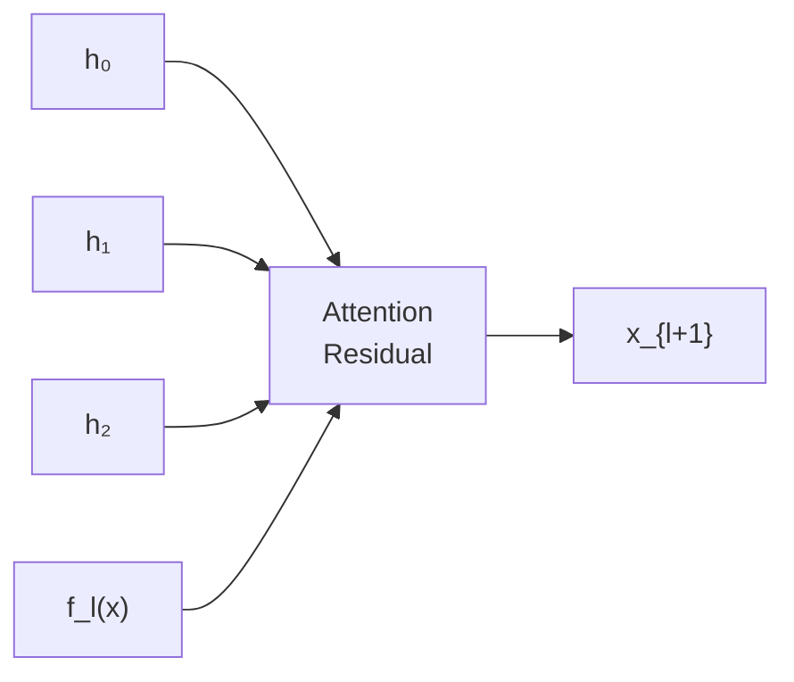

# 01 — Training Basics

> *Before we can understand why Attention Residuals matter, we need to
> understand how neural networks learn in the first place.*

---

## What Is Training?

Training a neural network means **adjusting its parameters** (weights and biases)
so that the model's predictions get closer to the correct answers.  The process
repeats thousands of times:

```
┌─────────────────────────────────────────────────────┐
│  for each batch of data:                            │
│    1. Forward pass   → compute predictions          │
│    2. Loss           → measure how wrong we are     │
│    3. Backward pass  → compute gradients            │
│    4. Optimizer step → update parameters            │
└─────────────────────────────────────────────────────┘
```

Let's walk through each step.

---

## 1. The Forward Pass

Data flows **forward** through the network: input → layer 1 → layer 2 → … → output.



Each layer applies a simple function — typically a matrix multiply followed by a
non-linearity:

```python
# In tinygrad:
h = x.linear(W, b).relu()   # h = relu(W @ x + b)
```

The forward pass is just function composition:  `ŷ = f₃(f₂(f₁(x)))`.

---

## 2. The Loss Function

After the forward pass we have a prediction `ŷ`.  The **loss** measures how
far `ŷ` is from the true label `y`:

```python
loss = logits.sparse_categorical_crossentropy(targets)
```

A lower loss means better predictions.  Training = making the loss go down.

---

## 3. The Backward Pass (Backpropagation)

To know *which direction* to nudge each weight, we compute the **gradient** of
the loss with respect to every parameter.  This is done automatically by the
**chain rule**, applied layer-by-layer in reverse:



In tinygrad, one line does it all:

```python
loss.backward()  # fills .grad on every parameter
```

> **Key insight:** The gradient tells you "if I increase this weight by a tiny
> amount, how much does the loss change?"  We then move the weight in the
> *opposite* direction.

---

## 4. SGD — Stochastic Gradient Descent

The simplest optimizer:

```
W_new = W_old - lr * gradient
```

where `lr` (learning rate) controls the step size.

**Why "stochastic"?**  Because we compute the gradient on a random *batch* of
data, not the entire dataset.  This noise actually helps escape bad local minima.

Modern optimizers (Adam, AdamW) add **momentum** and **adaptive learning rates**
but the core idea is the same: follow the gradient downhill.

---

## 5. Residual Connections — The Backbone of Deep Learning

### The Problem: Vanishing Gradients

In a plain deep network, gradients must travel through many layers during
backpropagation.  Each layer *multiplies* the gradient by its Jacobian, and
if that Jacobian has eigenvalues < 1, the gradient **shrinks exponentially**:

```
gradient at layer 1 ≈ gradient at layer L × (0.9)^L  →  tiny!
```

Deep networks (L > 20) become essentially untrainable.

### The Solution: Skip Connections (ResNet, 2015)

Instead of  `x_{l+1} = f_l(x_l)`,  use:

```
x_{l+1} = x_l + f_l(x_l)
```



The `+ x_l` creates a **shortcut** for the gradient — it can flow straight
through the addition without being multiplied by anything.  This is why
ResNets can be 100+ layers deep.

### The "Residual Stream"

Think of the hidden state `x` as a **stream** that flows through the network.
Each layer *reads* from the stream, computes something, and *writes* back by
adding its output.  The stream accumulates information.



---

## 6. The Hidden-State Dilution Problem

Here's the catch.  With uniform residuals, layer l's contribution to the
final hidden state is:

```
contribution of layer l  =  f_l(x_l) / L
```

As the network gets deeper (L grows), **every layer's voice gets quieter**.
The earliest layers, which capture fundamental features, are diluted the most.

| Depth L | Layer 1 contribution |
|---------|---------------------|
| 12      | ~8.3%               |
| 48      | ~2.1%               |
| 96      | ~1.0%               |

This is **hidden-state dilution** — the network has the capacity but can't
use it efficiently because the residual stream treats all layers equally.

---

## 7. Why Attention Residuals Fix This

The Attention Residuals concept replaces the fixed `+` with a **learned
attention mechanism** that looks at *all* previous layer outputs and decides
how much weight to give each one.



Now layer 1 can maintain a **strong** contribution even at depth 96, if the
attention mechanism learns that it's important.  This is the "glue" that lets
the network decide its own effective architecture at runtime.

> **Bottom line:** Attention Residuals give you ~1.25× the effective compute
> of a uniform-residual network at the same depth.  Or equivalently, you can
> match a deeper model's quality with fewer layers — which directly translates
> to memory and speed savings on hardware like the Jetson Orin.

---

## Next Steps

Now that you understand the *why*, read **`02_Attention_Residuals_Explained.md`**
for the *how* — the math, the code, and the Block AttnRes compression trick.
